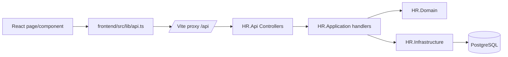
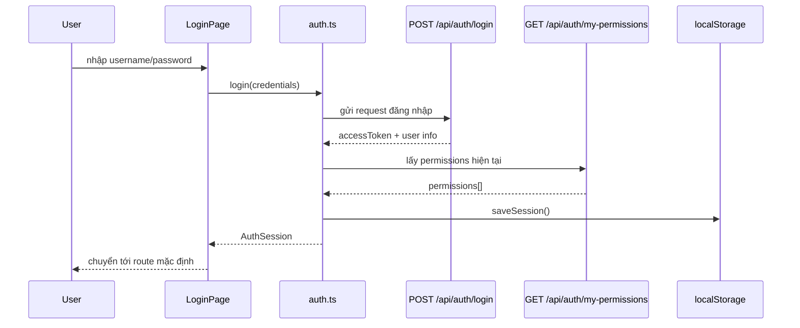
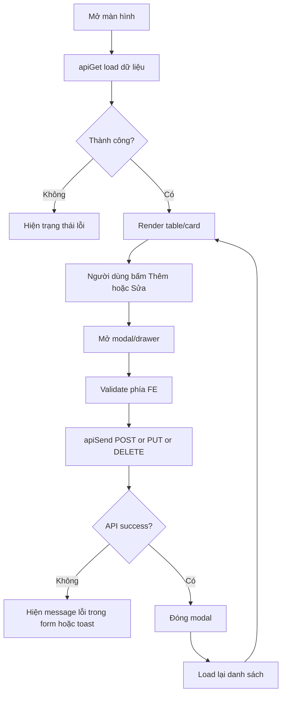
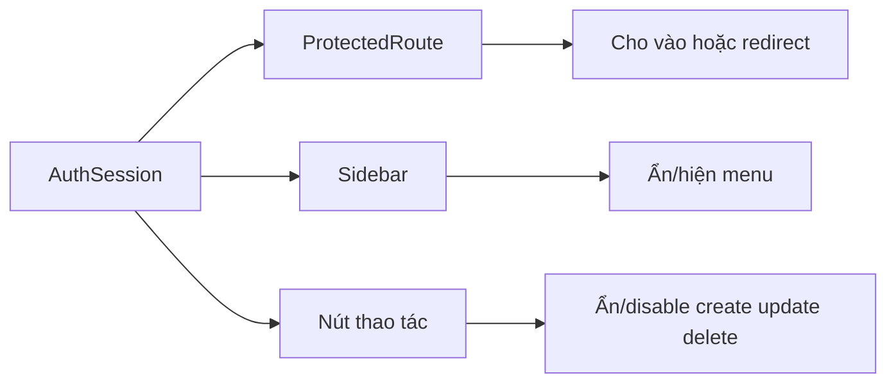
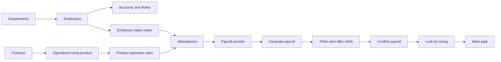

# Tổng quan dự án cho Frontend: fetch API, thiết kế UI và flow gọi API

Tài liệu này gom lại những gì frontend cần biết để:

- fetch API đúng với codebase hiện tại
- thiết kế giao diện bám đúng module backend
- hiểu các flow chính để triển khai màn hình nhanh hơn

Nguồn tham chiếu cuối cùng cho contract thực tế vẫn là:

- Swagger: `http://localhost:8088/swagger`
- `frontend/src/lib/api.ts`
- `frontend/src/lib/auth.ts`
- `frontend/src/lib/permissions.ts`
- `frontend/src/App.tsx`
- `backend/docs/frontend-payroll-ui-guide.md`
- `backend/docs/account-authorization.md`

## 1. Toàn cảnh hệ thống

| Phần | Công nghệ/chỗ chính | Vai trò |
| --- | --- | --- |
| Frontend | React 19 + TypeScript + Vite + Bun | Render UI, route, gọi API |
| Backend API | `backend/src/HR.Api` | Expose REST API, auth, trả `ApiResponse<T>` |
| Backend nghiệp vụ | `HR.Application`, `HR.Domain`, `HR.Infrastructure` | Validate, permission, business rule, persistence |
| Database | PostgreSQL | Lưu dữ liệu |

### URL dev thường dùng

| Môi trường | URL |
| --- | --- |
| Frontend dev | `http://localhost:3000` |
| Backend API | `http://localhost:8088` |
| Swagger | `http://localhost:8088/swagger` |

### Kiến trúc gọi API từ frontend



## 2. Frontend nên fetch API như thế nào

### 2.1 Quy tắc quan trọng

1. **Chỉ gọi endpoint dạng `/api/...`**, không hard-code host trong component.
2. Dev server đã proxy `/api` sang `VITE_API_TARGET` và mặc định là `http://localhost:8088`.
3. Dùng helper chung trong `frontend/src/lib/api.ts` thay vì `fetch` thủ công cho CRUD thường.
4. Dùng `frontend/src/lib/auth.ts` cho login, refresh current user, change password.
5. Dùng `frontend/src/lib/permissions.ts` để ẩn/hiện menu, route, button theo permission.

### 2.2 Response backend

Backend đang trả envelope chung:

```json
{
  "success": true,
  "message": "Operation completed successfully",
  "data": {}
}
```

Type frontend hiện có:

```ts
export interface ApiResponse<T> {
  success: boolean
  message: string
  data: T | null
}
```

### 2.3 Helper nên dùng

```ts
const departments = await apiGet<Department[]>('/api/departments', 'Không thể tải phòng ban')

await apiSend('/api/departments', 'POST', {
  code: 'HR',
  name: 'Nhân sự',
}, 'Không thể tạo phòng ban')
```

### Xử lý lỗi đã có sẵn trong `api.ts`

- `401`: bắn event `auth:unauthorized` để quay về login
- `403`: bắn event `auth:forbidden`
- `success = false`: ném `Error` với `message` từ backend

### 2.4 Auth session hiện tại

Frontend đang lưu session ở `localStorage` key `hr.auth` với dữ liệu:

- `accessToken`
- `accountId`
- `username`
- `fullName`
- `displayName`
- `employeeId`
- `roles`
- `permissions`

Flow lấy quyền:

1. `POST /api/auth/login`
2. lưu `accessToken`
3. gọi `GET /api/auth/my-permissions`
4. lưu `permissions`
5. render menu/trang/button theo quyền

### Flow login



## 3. Bản đồ màn hình frontend hiện tại

`frontend/src/App.tsx` đang route trực tiếp các màn chính sau:

| Route | Permission vào trang | API chính | Gợi ý UI |
| --- | --- | --- | --- |
| `/dashboard` | admin | `/api/employees`, `/api/payroll-periods`, `/api/audit-logs` | Card tổng quan + activity gần đây |
| `/departments` | `hr.departments.manage` | `/api/departments` | Table + modal thêm/sửa |
| `/employees` | `hr.employees.manage` | `/api/employees`, `/api/departments`, `/api/accounts`, `/api/roles` | Table + modal tab `profile/account/salary` |
| `/attendances` | `attendance.read` | `/api/attendances`, `/api/employees` | Calendar/list + form nhập ngày công |
| `/salary-periods` | `payroll.periods.read` | `/api/payroll-periods` | List kỳ lương + modal tạo kỳ + action lock/paid |
| `/payroll-runs` | `payroll.read` | `/api/payroll-periods`, `/api/payrolls/generate`, `/api/payrolls/{periodId}` | Layout master-detail |
| `/reports` | `payroll.reports.read` | `/api/payroll-reports`, `/api/payroll-periods` | Filter kỳ + report cards/table |
| `/system/accounts` | `accounts.manage` | `/api/accounts`, `/api/employees`, `/api/roles` | Table + modal gán nhân viên/role |
| `/system/roles` | `roles.manage` | `/api/roles`, `/api/permissions` | Danh sách role + checklist permission |

### Các module backend đã có nhưng route FE có thể mở thêm

| Module | API |
| --- | --- |
| Products | `/api/products` |
| Operations | `/api/operations` |
| Product operation rates | `/api/product-operation-rates` |
| Employee salary rates | `/api/employee-salary-rates` |
| Permissions | `/api/permissions` |
| Audit logs | `/api/audit-logs` |

## 4. Pattern UI nên áp dụng cho mọi màn CRUD

Một màn quản lý chuẩn trong dự án này nên có 5 khối:

1. **Page header**: tên màn + mô tả ngắn + nút tạo mới.
2. **Filter/search bar**: bộ lọc theo code, tên, trạng thái, kỳ, phòng ban...
3. **Data area**: table trên desktop, card/list trên mobile.
4. **Action area**: nút xem/sửa/xóa/lock/confirm theo permission.
5. **Modal hoặc drawer**: nhập form, hiển thị lỗi form, confirm action.

### Flow tải dữ liệu và submit form



### Flow render theo permission



## 5. Thiết kế UI gợi ý theo module

### 5.1 Auth

- **Login page**
  - form `username`, `password`
  - nút đăng nhập
  - lỗi đăng nhập đặt ngay dưới form
- **User menu**
  - tên hiển thị
  - role
  - đổi mật khẩu
  - đăng xuất

### 5.2 Departments

- table cột: `code`, `name`, `status`, `actions`
- modal thêm/sửa đơn giản
- xóa dùng confirm dialog

### 5.3 Employees

Màn này nên là màn trọng tâm của HR:

- table danh sách nhân viên
- modal hoặc drawer nhiều tab:
  - `Profile`: hồ sơ nhân viên
  - `Account`: tạo/cập nhật account gắn với nhân viên
  - `Salary`: đơn giá lương hoặc hồ sơ lương

Điểm quan trọng:

- load song song `employees`, `departments`, `accounts`, `roles`
- tab `Account` chỉ bật nếu người dùng có quyền account/role phù hợp

### 5.4 Attendance

UI nên có 2 lớp:

1. **Màn tổng quan**
   - lịch tháng hoặc bảng theo ngày
   - filter theo nhân viên, tháng, khoảng ngày
2. **Màn nhập/chỉnh sửa**
   - chọn nhân viên
   - ngày làm việc
   - giờ vào/ra
   - giờ công, OT

Lưu ý:

- `DateOnly` gửi dạng `YYYY-MM-DD`
- `DateTime` gửi ISO UTC, ví dụ `2026-05-13T08:00:00Z`

### 5.5 Payroll periods

UI nên gồm:

- danh sách kỳ lương
- modal tạo kỳ
- preview lịch/tháng để người dùng dễ kiểm tra range
- action theo trạng thái:
  - `Open` -> cho `Lock`
  - `Locked` -> cho `Mark paid`
  - `Locked/Paid` -> không cho xóa

### 5.6 Payroll runs

Màn này nên theo layout **master-detail**:

- cột trái: chọn kỳ lương
- phần trên: nút `Generate payroll`
- phần giữa: bảng payroll summary theo nhân viên
- phần phải hoặc drawer: chi tiết payroll + items điều chỉnh

### Flow nghiệp vụ payroll end-to-end



Frontend nên giữ đúng thứ tự này để tránh người dùng thao tác sai luồng.

### 5.7 Accounts, roles, permissions

### Accounts

- table danh sách tài khoản
- modal tạo/sửa account
- combobox chọn nhân viên liên kết
- checklist hoặc multiselect role

### Roles

- panel trái: danh sách role
- panel phải: form role + danh sách permission dạng checklist theo module

### Permissions

- chủ yếu dùng cho tra cứu/read-only
- có thể nhóm theo module: `accounts`, `roles`, `hr.departments`, `hr.employees`, `attendance`, `production`, `payroll`

## 6. Mapping nhanh: màn hình -> endpoint

| Nhóm màn | Endpoint nên gọi |
| --- | --- |
| Auth | `POST /api/auth/login`, `GET /api/auth/me`, `GET /api/auth/my-permissions`, `POST /api/auth/change-password` |
| Phòng ban | `GET/POST/PUT/DELETE /api/departments` |
| Nhân viên | `GET/POST/PUT/DELETE /api/employees` |
| Account | `GET/POST/PUT /api/accounts` |
| Role | `GET/POST/PUT /api/roles` |
| Permission | `GET /api/permissions` |
| Attendance | `GET/POST/DELETE /api/attendances` |
| Payroll periods | `GET/POST/DELETE /api/payroll-periods`, `POST /api/payroll-periods/{id}/lock`, `POST /api/payroll-periods/{id}/paid` |
| Payrolls | `POST /api/payrolls/generate`, `GET /api/payrolls/{periodId}`, `GET /api/payrolls/{periodId}/employees/{employeeId}`, `POST /api/payrolls/{payrollId}/confirm`, `POST /api/payrolls/{payrollId}/items` |
| Sản phẩm | `GET/POST/PUT/DELETE /api/products` |
| Công đoạn | `GET/POST/PUT/DELETE /api/operations` |
| Đơn giá công đoạn | `GET/POST/PUT/DELETE /api/product-operation-rates` |
| Đơn giá lương nhân viên | `GET /api/employee-salary-rates/{employeeId}`, `POST/PUT/DELETE /api/employee-salary-rates` |

## 7. Checklist để frontend triển khai màn mới

1. Xác định route trong `App.tsx`.
2. Xác định permission mở trang và permission cho từng action.
3. Tạo type trong `frontend/src/types/app.ts` nếu chưa có.
4. Dùng `apiGet` cho load list/detail.
5. Dùng `apiSend` cho create/update/delete/action.
6. Render đủ 4 trạng thái: `loading`, `error`, `empty`, `ready`.
7. Sau submit thành công, reload lại nguồn dữ liệu chính.
8. Nếu trang cần nhiều lookup data, dùng `Promise.all`.
9. Với ngày giờ, luôn dùng đúng format backend yêu cầu.
10. Kiểm tra lại payload thật trên Swagger trước khi chốt UI.

## 8. Quy ước nên giữ thống nhất trong toàn bộ UI

- Menu chỉ hiện khi có permission phù hợp.
- Nút create/update/delete chỉ hiện hoặc enable khi có quyền.
- Không để component tự parse envelope thủ công nhiều nơi; ưu tiên qua helper API chung.
- Không hard-code tên quyền trong nhiều file nếu có thể gom vào constant khi số màn tăng lớn.
- Với thao tác nguy hiểm như `delete`, `lock`, `mark paid`, `confirm payroll`, luôn có confirm dialog.
- Với màn nghiệp vụ lớn, ưu tiên chia thành:
  - container page
  - filter bar
  - data table/list
  - modal/form component

## 9. Response mẫu trả về theo API

> `message` là ví dụ minh họa. Text thực tế có thể thay đổi theo localizer, nhưng `success` và `data` là phần frontend nên bám chính.

### 9.1 Response envelope chung

#### Success

```json
{
  "success": true,
  "message": "Thao tác thành công",
  "data": {}
}
```

#### Error

```json
{
  "success": false,
  "message": "Dữ liệu không hợp lệ",
  "data": null
}
```

#### Lưu ý serialize

- property đang ở dạng **camelCase**
- enum đang được trả về dạng **string**
- phần lớn endpoint `DELETE` đang trả lại **id đã xóa** trong `data`

### 9.2 Auth

#### `POST /api/auth/login`

```json
{
  "success": true,
  "message": "Thao tác thành công",
  "data": {
    "accountId": "11111111-1111-1111-1111-111111111111",
    "username": "admin",
    "fullName": "Administrator",
    "employeeId": null,
    "accessToken": "eyJhbGciOiJIUzI1NiIsInR5cCI6IkpXVCJ9...",
    "roles": ["admin"]
  }
}
```

#### `GET /api/auth/me`

```json
{
  "success": true,
  "message": "Thao tác thành công",
  "data": {
    "accountId": "11111111-1111-1111-1111-111111111111",
    "username": "admin",
    "fullName": "Administrator",
    "employeeId": null,
    "roles": ["admin"],
    "permissions": [
      "accounts.manage",
      "roles.manage",
      "hr.employees.read",
      "payroll.read"
    ]
  }
}
```

#### `GET /api/auth/my-permissions`

```json
{
  "success": true,
  "message": "Thao tác thành công",
  "data": {
    "accountId": "11111111-1111-1111-1111-111111111111",
    "permissions": [
      "accounts.manage",
      "roles.manage",
      "hr.employees.read",
      "payroll.read"
    ]
  }
}
```

#### `POST /api/auth/change-password`

```json
{
  "success": true,
  "message": "Thao tác thành công",
  "data": {
    "accountId": "11111111-1111-1111-1111-111111111111"
  }
}
```

### 9.3 Departments

#### `GET /api/departments`

```json
{
  "success": true,
  "message": "Thao tác thành công",
  "data": [
    {
      "id": "22222222-2222-2222-2222-222222222222",
      "code": "HR",
      "name": "Nhân sự",
      "isActive": true
    }
  ]
}
```

#### `POST /api/departments`

```json
{
  "success": true,
  "message": "Thao tác thành công",
  "data": {
    "id": "22222222-2222-2222-2222-222222222222",
    "code": "HR",
    "name": "Nhân sự",
    "isActive": true
  }
}
```

#### `PUT /api/departments/{id}`

```json
{
  "success": true,
  "message": "Thao tác thành công",
  "data": {
    "id": "22222222-2222-2222-2222-222222222222",
    "code": "HR",
    "name": "Nhân sự - Hành chính",
    "isActive": true
  }
}
```

#### `DELETE /api/departments/{id}`

```json
{
  "success": true,
  "message": "Thao tác thành công",
  "data": "22222222-2222-2222-2222-222222222222"
}
```

### 9.4 Employees

#### `GET /api/employees`

```json
{
  "success": true,
  "message": "Thao tác thành công",
  "data": [
    {
      "id": "33333333-3333-3333-3333-333333333333",
      "code": "EMP001",
      "fullName": "Nguyen Van A",
      "departmentId": "22222222-2222-2222-2222-222222222222",
      "positionName": "Worker",
      "salaryCalculationType": "Mixed",
      "status": "Active"
    }
  ]
}
```

#### `POST /api/employees`

```json
{
  "success": true,
  "message": "Thao tác thành công",
  "data": {
    "id": "33333333-3333-3333-3333-333333333333",
    "code": "EMP001",
    "fullName": "Nguyen Van A",
    "departmentId": "22222222-2222-2222-2222-222222222222",
    "positionName": "Worker",
    "salaryCalculationType": "Mixed",
    "status": "Active"
  }
}
```

#### `PUT /api/employees/{id}`

```json
{
  "success": true,
  "message": "Thao tác thành công",
  "data": {
    "id": "33333333-3333-3333-3333-333333333333",
    "code": "EMP001",
    "fullName": "Nguyen Van A",
    "departmentId": "22222222-2222-2222-2222-222222222222",
    "positionName": "Senior Worker",
    "salaryCalculationType": "Mixed",
    "status": "Active"
  }
}
```

#### `DELETE /api/employees/{id}`

```json
{
  "success": true,
  "message": "Thao tác thành công",
  "data": "33333333-3333-3333-3333-333333333333"
}
```

### 9.5 Accounts, roles, permissions

#### `GET /api/accounts`

```json
{
  "success": true,
  "message": "Thao tác thành công",
  "data": [
    {
      "id": "44444444-4444-4444-4444-444444444444",
      "username": "emp001",
      "fullName": "Nguyen Van A",
      "status": "Active",
      "roles": ["employee"],
      "employeeId": "33333333-3333-3333-3333-333333333333"
    }
  ]
}
```

#### `POST /api/accounts`

```json
{
  "success": true,
  "message": "Thao tác thành công",
  "data": {
    "id": "44444444-4444-4444-4444-444444444444",
    "username": "emp001",
    "fullName": "Nguyen Van A",
    "status": "Active",
    "roleIds": ["55555555-5555-5555-5555-555555555555"],
    "employeeId": "33333333-3333-3333-3333-333333333333"
  }
}
```

#### `PUT /api/accounts/{id}`

```json
{
  "success": true,
  "message": "Thao tác thành công",
  "data": {
    "id": "44444444-4444-4444-4444-444444444444",
    "username": "emp001",
    "fullName": "Nguyen Van A",
    "status": "Active",
    "roleIds": ["55555555-5555-5555-5555-555555555555"],
    "employeeId": "33333333-3333-3333-3333-333333333333"
  }
}
```

#### `GET /api/roles`

```json
{
  "success": true,
  "message": "Thao tác thành công",
  "data": [
    {
      "id": "55555555-5555-5555-5555-555555555555",
      "code": "employee",
      "name": "Nhân viên",
      "isSystem": false,
      "isActive": true,
      "permissions": [
        "attendance.read",
        "payroll.read"
      ]
    }
  ]
}
```

#### `POST /api/roles`

```json
{
  "success": true,
  "message": "Thao tác thành công",
  "data": {
    "id": "55555555-5555-5555-5555-555555555555",
    "code": "employee",
    "name": "Nhân viên",
    "isActive": true,
    "permissionIds": [
      "66666666-6666-6666-6666-666666666666",
      "77777777-7777-7777-7777-777777777777"
    ]
  }
}
```

#### `PUT /api/roles/{id}`

```json
{
  "success": true,
  "message": "Thao tác thành công",
  "data": {
    "id": "55555555-5555-5555-5555-555555555555",
    "code": "employee",
    "name": "Nhân viên chính thức",
    "isActive": true,
    "permissionIds": [
      "66666666-6666-6666-6666-666666666666",
      "77777777-7777-7777-7777-777777777777"
    ]
  }
}
```

#### `GET /api/permissions`

```json
{
  "success": true,
  "message": "Thao tác thành công",
  "data": [
    {
      "id": "66666666-6666-6666-6666-666666666666",
      "module": "attendance",
      "code": "attendance.read",
      "name": "Xem chấm công",
      "isActive": true
    }
  ]
}
```

### 9.6 Products, operations, product-operation-rates

#### `GET /api/products`

```json
{
  "success": true,
  "message": "Thao tác thành công",
  "data": [
    {
      "id": "88888888-8888-8888-8888-888888888888",
      "code": "4012",
      "name": "Tui Black",
      "unit": "cai",
      "isActive": true
    }
  ]
}
```

#### `POST /api/products`

```json
{
  "success": true,
  "message": "Thao tác thành công",
  "data": {
    "id": "88888888-8888-8888-8888-888888888888",
    "code": "4012",
    "name": "Tui Black",
    "unit": "cai",
    "isActive": true
  }
}
```

#### `PUT /api/products/{id}`

```json
{
  "success": true,
  "message": "Thao tác thành công",
  "data": {
    "id": "88888888-8888-8888-8888-888888888888",
    "code": "4012",
    "name": "Tui Black Premium",
    "unit": "cai",
    "isActive": true
  }
}
```

#### `DELETE /api/products/{id}`

```json
{
  "success": true,
  "message": "Thao tác thành công",
  "data": "88888888-8888-8888-8888-888888888888"
}
```

#### `GET /api/products/{productId}/operations`

```json
{
  "success": true,
  "message": "Thao tác thành công",
  "data": [
    {
      "id": "99999999-9999-9999-9999-999999999999",
      "code": "OP-SEW-BODY",
      "name": "May than tui voi xop",
      "isActive": true
    }
  ]
}
```

#### `POST /api/products/{productId}/operations`

```json
{
  "success": true,
  "message": "Thao tác thành công",
  "data": {
    "productId": "88888888-8888-8888-8888-888888888888",
    "operationId": "99999999-9999-9999-9999-999999999999",
    "operationCode": "OP-SEW-BODY",
    "operationName": "May than tui voi xop",
    "isOperationActive": true,
    "createdNewOperation": true
  }
}
```

#### `DELETE /api/products/{productId}/operations/{operationId}`

```json
{
  "success": true,
  "message": "Thao tác thành công",
  "data": "aaaaaaaa-aaaa-aaaa-aaaa-aaaaaaaaaaaa"
}
```

#### `GET /api/products/{productId}/operations/{operationId}/rates`

```json
{
  "success": true,
  "message": "Thao tác thành công",
  "data": [
    {
      "id": "bbbbbbbb-bbbb-bbbb-bbbb-bbbbbbbbbbbb",
      "productId": "88888888-8888-8888-8888-888888888888",
      "operationId": "99999999-9999-9999-9999-999999999999",
      "workTimeType": "Regular",
      "unitPrice": 5000,
      "effectiveFrom": "2026-05-01",
      "effectiveTo": null,
      "isActive": true
    }
  ]
}
```

#### `GET /api/operations`

```json
{
  "success": true,
  "message": "Thao tác thành công",
  "data": [
    {
      "id": "99999999-9999-9999-9999-999999999999",
      "code": "OP-SEW-BODY",
      "name": "May than tui voi xop",
      "isActive": true
    }
  ]
}
```

#### `POST /api/operations`

```json
{
  "success": true,
  "message": "Thao tác thành công",
  "data": {
    "id": "99999999-9999-9999-9999-999999999999",
    "code": "OP-SEW-BODY",
    "name": "May than tui voi xop",
    "isActive": true
  }
}
```

#### `PUT /api/operations/{id}`

```json
{
  "success": true,
  "message": "Thao tác thành công",
  "data": {
    "id": "99999999-9999-9999-9999-999999999999",
    "code": "OP-SEW-BODY",
    "name": "May than tui voi xop - line 1",
    "isActive": true
  }
}
```

#### `DELETE /api/operations/{id}`

```json
{
  "success": true,
  "message": "Thao tác thành công",
  "data": "99999999-9999-9999-9999-999999999999"
}
```

#### `GET /api/product-operation-rates`

```json
{
  "success": true,
  "message": "Thao tác thành công",
  "data": [
    {
      "id": "bbbbbbbb-bbbb-bbbb-bbbb-bbbbbbbbbbbb",
      "productId": "88888888-8888-8888-8888-888888888888",
      "operationId": "99999999-9999-9999-9999-999999999999",
      "workTimeType": "Regular",
      "unitPrice": 5000,
      "effectiveFrom": "2026-05-01",
      "effectiveTo": null,
      "isActive": true
    }
  ]
}
```

#### `POST /api/product-operation-rates`

```json
{
  "success": true,
  "message": "Thao tác thành công",
  "data": {
    "id": "bbbbbbbb-bbbb-bbbb-bbbb-bbbbbbbbbbbb",
    "productId": "88888888-8888-8888-8888-888888888888",
    "operationId": "99999999-9999-9999-9999-999999999999",
    "workTimeType": "Regular",
    "unitPrice": 5000,
    "effectiveFrom": "2026-05-01",
    "effectiveTo": null,
    "isActive": true
  }
}
```

#### `PUT /api/product-operation-rates/{id}`

```json
{
  "success": true,
  "message": "Thao tác thành công",
  "data": {
    "id": "bbbbbbbb-bbbb-bbbb-bbbb-bbbbbbbbbbbb",
    "productId": "88888888-8888-8888-8888-888888888888",
    "operationId": "99999999-9999-9999-9999-999999999999",
    "workTimeType": "Regular",
    "unitPrice": 5200,
    "effectiveFrom": "2026-05-01",
    "effectiveTo": null,
    "isActive": true
  }
}
```

#### `DELETE /api/product-operation-rates/{id}`

```json
{
  "success": true,
  "message": "Thao tác thành công",
  "data": "bbbbbbbb-bbbb-bbbb-bbbb-bbbbbbbbbbbb"
}
```

### 9.7 Employee salary rates

#### `GET /api/employee-salary-rates/{employeeId}`

```json
{
  "success": true,
  "message": "Thao tác thành công",
  "data": [
    {
      "id": "cccccccc-cccc-cccc-cccc-cccccccccccc",
      "employeeId": "33333333-3333-3333-3333-333333333333",
      "calculationType": "Mixed",
      "monthlySalary": null,
      "dailyRate": 250000,
      "hourlyRate": 35000,
      "effectiveFrom": "2026-05-01",
      "effectiveTo": null,
      "isActive": true
    }
  ]
}
```

#### `POST /api/employee-salary-rates`

```json
{
  "success": true,
  "message": "Thao tác thành công",
  "data": {
    "id": "cccccccc-cccc-cccc-cccc-cccccccccccc",
    "employeeId": "33333333-3333-3333-3333-333333333333",
    "calculationType": "Mixed",
    "monthlySalary": null,
    "dailyRate": 250000,
    "hourlyRate": 35000,
    "effectiveFrom": "2026-05-01",
    "effectiveTo": null,
    "isActive": true
  }
}
```

#### `PUT /api/employee-salary-rates/{id}`

```json
{
  "success": true,
  "message": "Thao tác thành công",
  "data": {
    "id": "cccccccc-cccc-cccc-cccc-cccccccccccc",
    "employeeId": "33333333-3333-3333-3333-333333333333",
    "calculationType": "Mixed",
    "monthlySalary": null,
    "dailyRate": 260000,
    "hourlyRate": 36000,
    "effectiveFrom": "2026-05-01",
    "effectiveTo": null,
    "isActive": true
  }
}
```

#### `DELETE /api/employee-salary-rates/{id}`

```json
{
  "success": true,
  "message": "Thao tác thành công",
  "data": "cccccccc-cccc-cccc-cccc-cccccccccccc"
}
```

### 9.8 Attendances

#### `GET /api/attendances?employeeId=&fromDate=&toDate=`

```json
{
  "success": true,
  "message": "Thao tác thành công",
  "data": [
    {
      "id": "dddddddd-dddd-dddd-dddd-dddddddddddd",
      "employeeId": "33333333-3333-3333-3333-333333333333",
      "workDate": "2026-05-13",
      "shiftCode": "A",
      "checkIn": "2026-05-13T08:00:00Z",
      "checkOut": "2026-05-13T17:00:00Z",
      "workingHours": 8,
      "workingDayValue": 1,
      "overtimeHours": 2,
      "status": "Draft"
    }
  ]
}
```

#### `POST /api/attendances`

```json
{
  "success": true,
  "message": "Thao tác thành công",
  "data": {
    "id": "dddddddd-dddd-dddd-dddd-dddddddddddd",
    "employeeId": "33333333-3333-3333-3333-333333333333",
    "workDate": "2026-05-13",
    "workingHours": 8,
    "workingDayValue": 1,
    "overtimeHours": 2,
    "status": "Draft"
  }
}
```

#### `DELETE /api/attendances/{id}`

```json
{
  "success": true,
  "message": "Thao tác thành công",
  "data": "dddddddd-dddd-dddd-dddd-dddddddddddd"
}
```

### 9.9 Payroll periods

#### `GET /api/payroll-periods`

```json
{
  "success": true,
  "message": "Thao tác thành công",
  "data": [
    {
      "id": "eeeeeeee-eeee-eeee-eeee-eeeeeeeeeeee",
      "name": "Kỳ lương tháng 05/2026",
      "fromDate": "2026-05-01",
      "toDate": "2026-05-31",
      "status": "Open"
    }
  ]
}
```

#### `POST /api/payroll-periods`

```json
{
  "success": true,
  "message": "Thao tác thành công",
  "data": {
    "id": "eeeeeeee-eeee-eeee-eeee-eeeeeeeeeeee",
    "name": "Kỳ lương tháng 05/2026",
    "fromDate": "2026-05-01",
    "toDate": "2026-05-31",
    "status": "Open"
  }
}
```

#### `POST /api/payroll-periods/{id}/lock`

```json
{
  "success": true,
  "message": "Thao tác thành công",
  "data": {
    "id": "eeeeeeee-eeee-eeee-eeee-eeeeeeeeeeee",
    "status": "Locked"
  }
}
```

#### `POST /api/payroll-periods/{id}/paid`

```json
{
  "success": true,
  "message": "Thao tác thành công",
  "data": {
    "id": "eeeeeeee-eeee-eeee-eeee-eeeeeeeeeeee",
    "status": "Paid"
  }
}
```

#### `DELETE /api/payroll-periods/{id}`

```json
{
  "success": true,
  "message": "Thao tác thành công",
  "data": "eeeeeeee-eeee-eeee-eeee-eeeeeeeeeeee"
}
```

### 9.10 Payrolls

#### `POST /api/payrolls/generate`

```json
{
  "success": true,
  "message": "Thao tác thành công",
  "data": {
    "payrollPeriodId": "eeeeeeee-eeee-eeee-eeee-eeeeeeeeeeee",
    "employeeCount": 12,
    "totalNetSalary": 84500000
  }
}
```

#### `GET /api/payrolls/{periodId}`

```json
{
  "success": true,
  "message": "Thao tác thành công",
  "data": [
    {
      "payrollId": "ffffffff-ffff-ffff-ffff-ffffffffffff",
      "employeeId": "33333333-3333-3333-3333-333333333333",
      "employeeCode": "EMP001",
      "employeeName": "Nguyen Van A",
      "attendanceSalary": 6500000,
      "productSalary": 3500000,
      "overtimeSalary": 800000,
      "grossSalary": 11200000,
      "netSalary": 10600000,
      "status": "Calculated"
    }
  ]
}
```

#### `GET /api/payrolls/{periodId}/employees/{employeeId}`

```json
{
  "success": true,
  "message": "Thao tác thành công",
  "data": {
    "payrollId": "ffffffff-ffff-ffff-ffff-ffffffffffff",
    "payrollPeriodId": "eeeeeeee-eeee-eeee-eeee-eeeeeeeeeeee",
    "employeeId": "33333333-3333-3333-3333-333333333333",
    "employeeCode": "EMP001",
    "employeeName": "Nguyen Van A",
    "attendanceSalary": 6500000,
    "productSalary": 3500000,
    "overtimeSalary": 800000,
    "allowanceAmount": 300000,
    "bonusAmount": 500000,
    "deductionAmount": 200000,
    "grossSalary": 11200000,
    "netSalary": 10600000,
    "status": "Calculated",
    "items": [
      {
        "id": "12121212-1212-1212-1212-121212121212",
        "type": "AttendanceSalary",
        "name": "Lương công",
        "quantity": 26,
        "unitPrice": 250000,
        "amount": 6500000,
        "sourceType": "Attendance",
        "sourceId": "dddddddd-dddd-dddd-dddd-dddddddddddd"
      },
      {
        "id": "13131313-1313-1313-1313-131313131313",
        "type": "Allowance",
        "name": "Phụ cấp cơm",
        "quantity": 20,
        "unitPrice": 15000,
        "amount": 300000,
        "sourceType": null,
        "sourceId": null
      }
    ]
  }
}
```

#### `POST /api/payrolls/{payrollId}/confirm`

```json
{
  "success": true,
  "message": "Thao tác thành công",
  "data": {
    "payrollId": "ffffffff-ffff-ffff-ffff-ffffffffffff",
    "status": "Confirmed"
  }
}
```

#### `POST /api/payrolls/{payrollId}/items`

```json
{
  "success": true,
  "message": "Thao tác thành công",
  "data": {
    "payrollId": "ffffffff-ffff-ffff-ffff-ffffffffffff",
    "grossSalary": 11200000,
    "netSalary": 10600000
  }
}
```

### 9.11 Reports và audit logs

#### `GET /api/payroll-reports/periods/{periodId}`

```json
{
  "success": true,
  "message": "Thao tác thành công",
  "data": {
    "payrollPeriodId": "eeeeeeee-eeee-eeee-eeee-eeeeeeeeeeee",
    "periodName": "Kỳ lương tháng 05/2026",
    "employeeCount": 12,
    "totalAttendanceSalary": 52000000,
    "totalProductSalary": 21000000,
    "totalOvertimeSalary": 4500000,
    "totalGrossSalary": 84500000,
    "totalNetSalary": 80100000
  }
}
```

#### `GET /api/audit-logs?take=6`

```json
{
  "success": true,
  "message": "Thao tác thành công",
  "data": [
    {
      "id": "14141414-1414-1414-1414-141414141414",
      "module": "Payroll",
      "action": "Generate",
      "entityName": "PayrollPeriod",
      "entityId": "eeeeeeee-eeee-eeee-eeee-eeeeeeeeeeee",
      "description": "Generated payroll for payroll period 05/2026",
      "performedAtUtc": "2026-05-23T08:15:30Z"
    }
  ]
}
```

## 10. Tài liệu liên quan

- `frontend/README.md`
- `backend/README.md`
- `backend/docs/frontend-payroll-ui-guide.md`
- `backend/docs/account-authorization.md`
- `backend/docs/frontend-calendar-dashboard-api-request.md`
